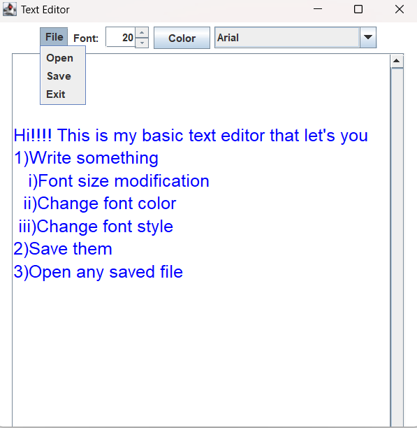

# Basic Text Editor

This is a basic text editor application built using Java and Java Swing. It provides a simple user interface for creating, opening, editing, and saving text files.

## Features

- Create a new text file
- Open an existing text file
- Edit the text content
- Save the text file
- Save the text file as a different name/location

## Prerequisites

To run this application, you need to have the following installed:

- Java Development Kit (JDK) version 8 or higher

## Getting Started

1. Clone the repository:

  javac *.java

   git clone [https://github.com/your-username/basic-text-editor.git](https://github.com/theDarkHorse17/texteditor.git)
